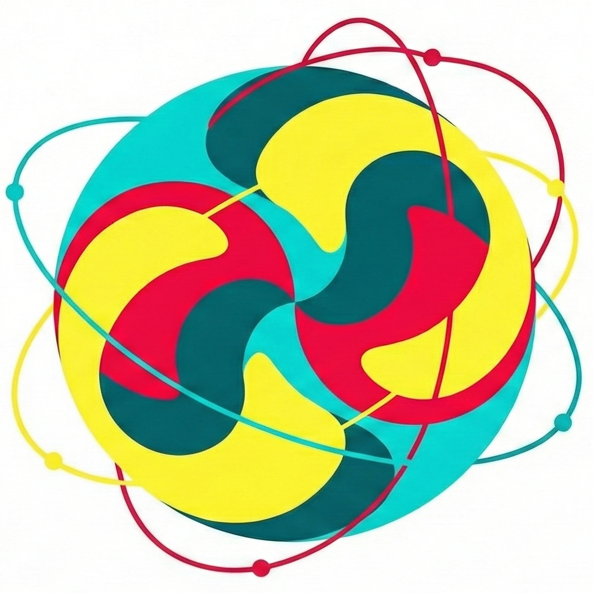

<h1 align="center">Quark</h1>
<p align="center">
  
</p>

<p align="center">
  <a href="https://www.python.org/downloads/"></a>
  <a href="https://pytorch.org/"></a>
  <a href="https://github.com/fla-org/flash-linear-attention"></a>
  <a href="https://opensource.org/licenses/MIT"></a>
</p>

A minimal playground for language modeling research. The goal is to provide a clean, hackable base for training and experimenting with GPT-style models — without the overhead of a large framework. Ships with a standard pre-norm transformer (causal attention + SwiGLU MLP) and a training pipeline built on Hydra, W&B, and DDP. This pipeline is adapted from [PlainLM](https://github.com/Niccolo-Ajroldi/plainLM).


## Setup

Clone the repo with submodules (required for flash-linear-attention):

```bash
git clone --recurse-submodules https://github.com/philippnazari/quark
```

If you already cloned without `--recurse-submodules`, fetch the submodules with:

```bash
git submodule update --init --recursive
```

Then install dependencies:

```bash
uv sync
uv run pre-commit install
```

For development (adds ruff and pre-commit):

```bash
uv sync --extra dev
```

## Data

Download and tokenize FineWeb-Edu 10B into chunked Arrow files. Only needs to be run once — the result is reused across training runs.

```bash
.venv/bin/python -m data.datasets.prepare \
  --dataset_path HuggingFaceFW/fineweb-edu \
  --dataset_name sample-10BT \
  --tokenizer gpt2 \
  --seq_length 256 \
  --out_path data/fineweb10B \
  --n_tokens_valid 10000000
```

## Training

Config is managed by Hydra (`configs/`). All keys can be overridden from the CLI.

Train the default transformer:

```bash
.venv/bin/python train.py
```

Train DeltaNet:

```bash
.venv/bin/python train.py model=delta_net
```

Scale to multiple GPUs with DDP:

```bash
torchrun --standalone --nproc_per_node=4 train.py model=delta_net
```

Any config value can be overridden from the CLI:

```bash
.venv/bin/python train.py model=delta_net training.lr=1e-4 training.steps_budget=10000
```

Print the fully resolved config without running:

```bash
.venv/bin/python train.py --cfg job
```

Training logs to W&B and optionally saves checkpoints to `out_dir/exp_name` (configured in `configs/config.yaml`).

## W&B

Before the first run, authenticate:

```bash
uv run wandb login
```

The W&B project name and run name are set in `configs/config.yaml`:

```yaml
logging:
  wandb_project: quark        # project name on wandb.ai
  wandb_log: true

checkpoint:
  exp_name: my_experiment     # also used as the run name in W&B
```
